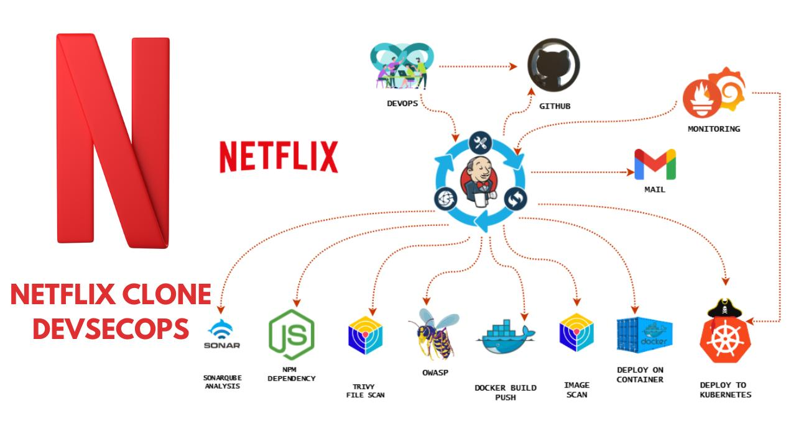

# 🎬 Netflix Clone DevSecOps Project

## 📌 Project Overview

This project demonstrates a complete **DevSecOps CI/CD Pipeline** for deploying a **Netflix Clone Application** using modern DevOps, Security, Containerization, and Cloud technologies.

---

<h2 align="center">🏗️ DevSecOps Architecture</h2>

<p align="center">
  
</p>

---


# 🖥️ Application Preview

## Netflix Clone

A modern and responsive Netflix-clone web application built using:

* React 18
* TypeScript
* Redux Toolkit
* Material UI (MUI)
* Framer Motion
* React Router DOM
* React Slick Carousel
* Video.js
* Vite

### Features

* Responsive Netflix-style user interface
* Movie and TV show browsing experience
* Dynamic video playback using Video.js
* Smooth animations powered by Framer Motion
* State management with Redux Toolkit
* Fast development and optimized builds using Vite
* Modern TypeScript-based codebase

---

## 🔧 Project Integrations

* CI/CD Automation
* Security Scanning
* Docker Containerization
* Kubernetes Deployment
* AWS EKS
* Infrastructure as Code (Terraform)
* Monitoring & Observability

---

# 🚀 DevSecOps Tools Used

* Jenkins
* SonarQube
* Trivy
* Docker
* Kubernetes
* AWS EKS
* Terraform
* Prometheus
* Grafana

---

# 📁 Project Structure

```bash
netflix-devsecops/
├── Dockerfile
├── Jenkinsfile
├── Steps.txt
├── EKS_TERRAFORM
│   ├── backend.tf
│   ├── main.tf
│   └── provider.tf
├── Kubernetes
│   ├── deployment.yml
│   └── service.yml
├── public
├── src
├── package.json
├── vite.config.ts
└── README.md
```

---

# 🎯 Features

* Netflix UI Clone
* TMDB API Integration
* Responsive UI Design
* Infinite Scrolling
* Video Streaming Components
* CI/CD Pipeline Automation
* Security & Vulnerability Scanning
* Dockerized Deployment
* Kubernetes Deployment on AWS EKS
* Infrastructure Provisioning with Terraform
* Monitoring with Prometheus & Grafana

---

# ⚙️ CI/CD Pipeline Stages

| Stage                 | Description                     |
| --------------------- | ------------------------------- |
| Clean Workspace       | Clean Jenkins workspace         |
| Checkout Code         | Pull source code from GitHub    |
| SonarQube Analysis    | Static code analysis            |
| Quality Gate          | Validate code quality           |
| Install Dependencies  | Install Node.js packages        |
| Trivy FS Scan         | Scan filesystem vulnerabilities |
| Docker Build & Push   | Build and push Docker image     |
| Trivy Image Scan      | Scan Docker image               |
| Deploy to Container   | Deploy application using Docker |
| Kubernetes Deployment | Deploy application to AWS EKS   |

---

# 🔐 Security Scanning

## SonarQube

* Bug Detection
* Vulnerability Detection
* Code Smells
* Security Hotspots
* Duplicate Code Analysis

## Trivy

* File System Scanning
* Docker Image Scanning
* Vulnerability Detection
* Security Risk Assessment

---

# ☁️ AWS EKS Deployment

The application is deployed to an Amazon EKS cluster using Kubernetes manifests and Terraform-managed infrastructure.

Deployment includes:

* EKS Cluster Provisioning
* Kubernetes Deployments
* Kubernetes Services
* Containerized Application Hosting

---

# 📊 Monitoring Setup

## Prometheus

Used for:

* Kubernetes Monitoring
* Node Monitoring
* Metrics Collection

## Grafana

Used for:

* Dashboard Visualization
* CPU Monitoring
* Memory Monitoring
* Pod Monitoring
* Cluster Health Monitoring

---

# 📚 Detailed Setup Guide

Complete installation steps, Jenkins configuration, Terraform provisioning, Kubernetes deployment, and troubleshooting documentation are available in:

```bash
Steps.txt
```

---

# 🚀 Deployment

Clone the repository:

```bash
git clone https://github.com/vicky9168/netflix-devsecops.git

cd netflix-devsecops
```

Run the Jenkins Pipeline to:

* Build the application
* Perform security scans
* Build and push Docker images
* Deploy to Kubernetes on AWS EKS
* Enable monitoring and observability

---

# 🌐 Application Access

After successful deployment to Amazon EKS, verify the service:

```bash
kubectl get svc
```

Copy the External LoadBalancer URL and open it in your browser.

Example:

```text
http://<load-balancer-url>
```

You should now be able to access the Netflix Clone application.

---


# 📈 Future Improvements

* Slack Notifications
* ArgoCD GitOps
* Helm Charts
* Blue-Green Deployment
* Kubernetes HPA
* AWS CloudWatch Integration
* SSL/TLS Configuration
* Ingress Controller
* Route53 Domain Mapping

---

# 👨‍💻 Author

## Vivek Dhole
